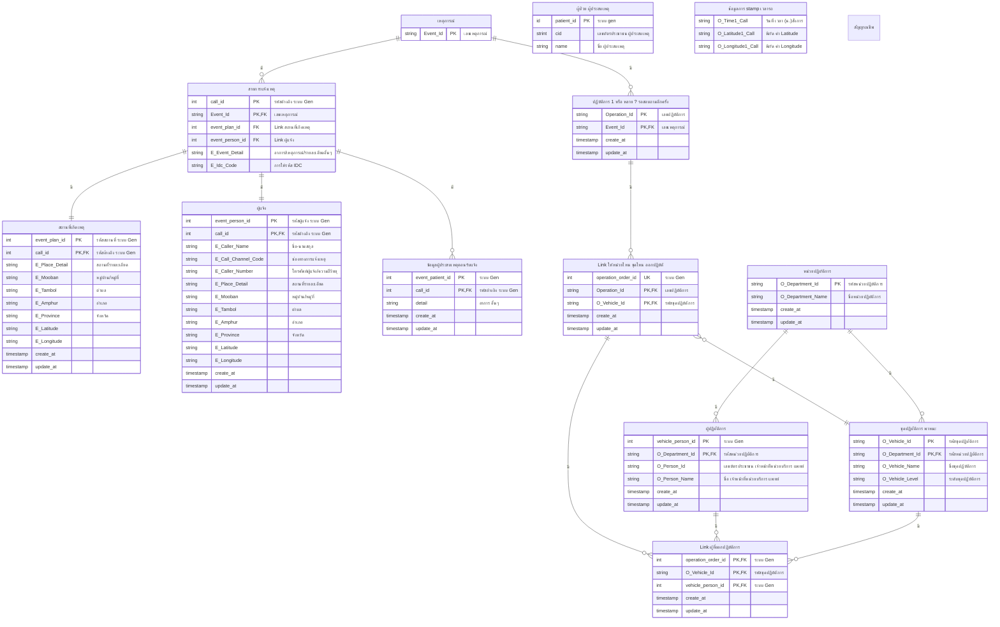

# Er

```mermaid
erDiagram
    event["เหตุการณ์"]{
        string Event_Id PK "เลขเหตุการณ์"
    }
    
    call["สายการแจ้งเหตุ"] {
        int call_id PK "รหัสอ้างอิง ระบบ Gen"
        string Event_Id PK,FK "เลขเหตุการณ์"
        int event_plan_id FK "Link สถานที่เกิดเหตุ"
        int event_person_id FK "Link ผู้แจ้ง"
        string E_Event_Detail"อาการ/เหตุการณ์/รายละเอียดอื่นๆ"
        string E_Idc_Code"การให้รหัส IDC"
        
    }
    call_plan["สถานที่เกิดเหตุ"]{
        int event_plan_id PK "รหัสสถานที่ ระบบ Gen"
        int call_id PK,FK "รหัสอ้างอิง ระบบ Gen"
        string E_Place_Detail"สถานที่รายละเอียด"
        string E_Mooban"หมู่บ้าน/หมู่ที่"
        string E_Tambol"ตำบล"
        string E_Amphur"อำเภอ"
        string E_Province"จังหวัด"
        string E_Latitude
        string E_Longitude
        timestamp create_at
        timestamp update_at
    }
    call_person["ผู้แจ้ง"]{
        int event_person_id PK "รหัสผู้แจ้ง ระบบ Gen"
        int call_id PK,FK "รหัสอ้างอิง ระบบ Gen"
        string E_Caller_Name"ชื่อ-นามสกุล"
        string E_Call_Channel_Code"ช่องทางการแจ้งเหตุ"
        string E_Caller_Number"โทรศัพท์ผู้แจ้ง/ความถี่วิทยุ"
        string E_Place_Detail"สถานที่รายละเอียด"
        string E_Mooban"หมู่บ้าน/หมู่ที่"
        string E_Tambol"ตำบล"
        string E_Amphur"อำเภอ"
        string E_Province"จังหวัด"
        string E_Latitude
        string E_Longitude
        timestamp create_at
        timestamp update_at
    }
    call_patient["ข้อมูลผู้ประสบเหตุตอนรับแจ้ง"]{
        int event_patient_id PK "ระบบ Gen"
        int call_id PK,FK "รหัสอ้างอิง ระบบ Gen"
        string detail "อาการ อื่นๆ"
        timestamp create_at
        timestamp update_at
    }

    event 1--many call : "มี"
    call 1--1 call_plan : "มี"
    call  1--1 call_person : "มี"
    call 1--many call_patient : "มี"

    ope["ปฏิบัติการ 1 หรือ หลาย ? รอสอบถามอีกครั้ง"]{
        string Operation_Id PK "เลขปฏิบัติการ"
        string Event_Id PK,FK "เลขเหตุการณ์"
        timestamp create_at
        timestamp update_at
    }

    ope_order_vehicle ["Link ให้หน่วยไหน ชุดไหน ออกปฏิบัติ"]{
        int operation_order_id UK "ระบบ Gen"
        string Operation_Id PK,FK "เลขปฏิบัติการ"
        string O_Vehicle_Id PK,FK "รหัสชุดปฏิบัติการ"
        timestamp create_at
        timestamp update_at
    }
    
    organization ["หน่วยปฏิบัติการ"]{
        string O_Department_Id PK "รหัสหน่วยปฏิบัติการ"
        string O_Department_Name "ชื่อหน่วยปฏิบัติการ"
        timestamp create_at
        timestamp update_at
    }

    vehicle ["ชุดปฏิบัติการ พาหนะ"]{
        string O_Vehicle_Id PK "รหัสชุดปฏิบัติการ"
        string O_Department_Id PK,FK "รหัสหน่วยปฏิบัติการ"
        string O_Vehicle_Name "ชื่อชุดปฏิบัติการ"
        string O_Vehicle_Level "ระดับชุดปฏิบัติการ"
        timestamp create_at
        timestamp update_at
    }
    vehicle_person["ผู้ปฏิบัติการ"]{
        int vehicle_person_id PK "ระบบ Gen"
        string O_Department_Id PK,FK "รหัสหน่วยปฏิบัติการ"
        string O_Person_Id "เลขบัตรประชาชน เจ้าหน้าที่หน่วยบริการ แพทย์"
        string O_Person_Name "ชื่อ เจ้าหน้าที่หน่วยบริการ แพทย์"
        timestamp create_at
        timestamp update_at
    }
    vehicle_link_person["Link ผู้ที่ออกปฏิบัติการ"]{
        int operation_order_id PK,FK "ระบบ Gen"
        string O_Vehicle_Id PK,FK "รหัสชุดปฏิบัติการ"
        int vehicle_person_id PK,FK "ระบบ Gen"
        timestamp create_at
        timestamp update_at
    }

    event 1--many ope : "มี"
    ope 1--many ope_order_vehicle :"มี" 
    ope_order_vehicle many--1 vehicle: "มี"
    organization 1--many vehicle : "มี"
    ope_order_vehicle 1--many vehicle_link_person : "มี"
    vehicle_person 1--many vehicle_link_person : "มี"
    vehicle 1--many vehicle_link_person : "มี"
    organization 1--many vehicle_person : "มี"


    patient ["ผู้ป่วย ผู้ประสบเหตุ"]{
        id patient_id PK "ระบบ gen"
        strint cid "เลขบัตรประชาชน ผู้ประสบเหตุ"
        string name "ชื่อ ผู้ประสบเหตุ"
    }

    vehicle_stamp["ข้อมูลการ stamp เวลารถ"]{
        string O_Time1_Call "วันที่ เวลา (น.)สั่งการ"
        string O_Latitude1_Call "พิกัด ค่า Latitude"
        string O_Longitude1_Call "พิกัด ค่า Longitude"
    }

    vital_sign["สัญญาณชีพ"]


```
